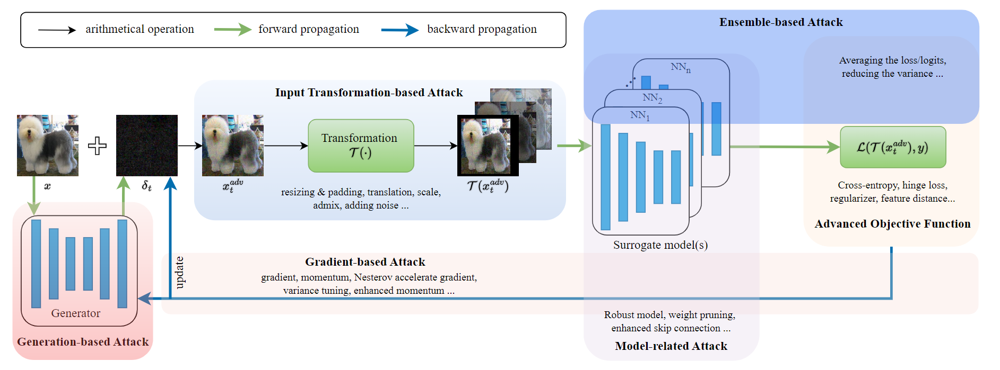

<h1 align="center">TransferAttack</h1>

## About
<p align="center">
  <a href="https://github.com/Trustworthy-AI-Group/TransferAttack/stargazers"> </a>
  <a href="https://github.com/Trustworthy-AI-Group/TransferAttack/issues"> </a>
  <a href="https://github.com/Trustworthy-AI-Group/TransferAttack/forks"> </a>
</p>

TransferAttack is a pytorch framework to boost the adversarial transferability for image classification.

[Devling into Adversarial Transferability on Image Classification: A Review, Benchmark and Evaluation](./README.md) will be released soon.




We also release a list of papers about transfer-based attacks [here](https://xiaosenwang.com/transfer_based_attack_papers.html).

### Why TransferAttack

There are a lot of reasons for TransferAttack, such as:

+ **A benchmark for evaluating new transfer-based attacks**: TransferAttack categorizes existing transfer-based attacks into several types and fairly evaluates various transfer-based attacks under the same setting.
+ **Evaluate the robustness of deep models**: TransferAttack provides a plug-and-play interface to verify the robustness of models, such as CNNs and ViTs.
+ **A summary of transfer-based attacks**: TransferAttack reviews numerous transfer-based attacks, making it easy to get the whole picture of transfer-based attacks for practitioners.

## Requirements
+ Python >= 3.6
+ PyTorch >= 1.12.1
+ Torchvision >= 0.13.1
+ timm >= 0.6.12

```bash
pip install -r requirements.txt
```


## Usage
We randomly sample 1,000 images from ImageNet validate set, in which each image is from one category and can be correctly classified by the adopted models (For some categories, we cannot choose one image that is correctly classified by all the models. In this case, we select the image that receives accurate classifications from the majority of models.). Download the data from [
](https://drive.google.com/file/d/1d-_PKYi3MBDPtJV4rfMCCtmsE0oWX7ZB/view?usp=sharing) or [](https://huggingface.co/datasets/Trustworthy-AI-Group/TransferAttack/blob/main/data.zip) into `/path/to/data`. Then you can execute the attack as follows:

```
python main.py --input_dir ./path/to/data --output_dir adv_data/mifgsm/resnet18 --attack mifgsm --model=resnet18
python main.py --input_dir ./path/to/data --output_dir adv_data/mifgsm/resnet18 --eval
```

## Attacks and Models

### Untargeted Attacks

<table  style="width:100%" border="1">
<thead>
<tr class="header">
<th><strong>Category</strong></th>
<th><strong>Attack </strong></th>
<th><strong>Main Idea</strong></th>
</tr>
</thead>

<tr>
<th rowspan="23"><sub><strong>Gradient-based</strong></sub></th>
<td><a href="https://arxiv.org/abs/1412.6572" target="_blank" rel="noopener noreferrer">FGSM (Goodfellow et al., 2015)</a></td>
<td ><sub>Add a small perturbation in the direction of gradient</sub></td>
</tr>

<tr>
<td><a href="https://arxiv.org/abs/1607.02533" target="_blank" rel="noopener noreferrer">I-FGSM (Kurakin et al., 2015)</a></td>
<td ><sub>Iterative version of FGSM</sub></td>
</tr>

<tr>
<td><a href="https://openaccess.thecvf.com/content_cvpr_2018/papers/Dong_Boosting_Adversarial_Attacks_CVPR_2018_paper.pdf" target="_blank" rel="noopener noreferrer">MI-FGSM (Dong et al., 2018)</a></td>
<td ><sub>Integrate the momentum term into the I-FGSM</sub></td>
</tr>

<tr>
<td><a href="https://openreview.net/pdf?id=SJlHwkBYDH" target="_blank" rel="noopener noreferrer">NI-FGSM (Lin et al., 2020)</a></td>
<td ><sub>Integrate the Nesterov's accelerated gradient into I-FGSM</sub></td>
</tr>

<tr>
<td><a href="https://www.ecva.net/papers/eccv_2020/papers_ECCV/papers/123730307.pdf" target="_blank" rel="noopener noreferrer">PI-FGSM (Gao et al., 2020)</a></td>
<td ><sub>Reuse the cut noise and apply a heuristic project strategy to generate patch-wise noise</sub></td>
</tr>

<tr>
<td><a href="https://openaccess.thecvf.com/content/CVPR2021/papers/Wang_Enhancing_the_Transferability_of_Adversarial_Attacks_Through_Variance_Tuning_CVPR_2021_paper.pdf" target="_blank" rel="noopener noreferrer">VMI-FGSM (Wang et al., 2021)</a></td>
<td ><sub>Variance tuning MI-FGSM</sub></td>
</tr>

<tr>
<td><a href="https://openaccess.thecvf.com/content/CVPR2021/papers/Wang_Enhancing_the_Transferability_of_Adversarial_Attacks_Through_Variance_Tuning_CVPR_2021_paper.pdf" target="_blank" rel="noopener noreferrer">VNI-FGSM (Wang et al., 2021)</a></td>
<td ><sub>Variance tuning NI-FGSM</sub></td>
</tr>

<tr>
<td><a href="https://arxiv.org/abs/2103.10609" target="_blank" rel="noopener noreferrer">EMI-FGSM (Wang et al., 2021)</a></td>
<td ><sub>Accumulate the gradients of several data points linearly sampled in the direction of previous gradient</sub></td>
</tr>

<tr>
<td><a href="https://arxiv.org/abs/2007.03838" target="_blank" rel="noopener noreferrer">AI-FGTM (Zou et al., 2022)</a></td>
<td ><sub>Adopt Adam to adjust the step size and momentum using the tanh function</sub></td>
</tr>

<tr>
<td><a href="https://arxiv.org/abs/2104.09722" target="_blank" rel="noopener noreferrer">I-FGS²M (Zhang et al., 2021)</a></td>
<td ><sub>Assigning staircase weights to each interval of the gradient</sub></td>
</tr>

<tr>
<td><a href="https://arxiv.org/abs/2307.02828" target="_blank" rel="noopener noreferrer">SMI-FGRM (Han et al., 2023)</a></td>
<td ><sub> Substitute the sign function with data rescaling and use the depth first sampling technique to stabilize the update direction.</sub></td>
</tr>

<tr>
<td><a href="https://www.ijcai.org/proceedings/2022/0227.pdf" target="_blank" rel="noopener noreferrer">VA-I-FGSM (Zhang et al., 2022)</a></td>
<td ><sub>Adopt a larger step size and auxiliary gradients from other categories</sub></td>
</tr>

<tr>
<td><a href="https://arxiv.org/abs/2210.05968" target="_blank" rel="noopener noreferrer">RAP (Qin et al., 2022)</a></td>
<td ><sub> Inject the worst-case perturbation when calculating the gradient.</sub></td>
</tr>

<tr>
<td><a href="https://arxiv.org/abs/2306.01809" target="_blank" rel="noopener noreferrer">PC-I-FGSM (Wan et al., 2023)</a></td>
<td ><sub>Gradient Prediction-Correction on MI-FGSM</sub></td>
</tr>

<tr>
<td><a href="https://ieeexplore.ieee.org/document/10096558" target="_blank" rel="noopener noreferrer">IE-FGSM (Peng et al., 2023)</a></td>
<td ><sub> Integrate anticipatory data point to stabilize the update direction.</sub></td>
</tr>

<tr>
<td><a href="https://openaccess.thecvf.com/content/ICCV2023/papers/Zhu_Boosting_Adversarial_Transferability_via_Gradient_Relevance_Attack_ICCV_2023_paper.pdf" target="_blank" rel="noopener noreferrer">GRA (Zhu et al., 2023)</a></td>
<td ><sub>Correct the gradient using the average gradient of several data points sampled in the neighborhood and adjust the update gradient with a decay indicator</sub></td>
</tr>

<tr>
<td><a href="https://ieeexplore.ieee.org/abstract/document/10223158" target="_blank" rel="noopener noreferrer">GNP (Wu et al., 2023)</a></td>
<td ><sub>Introduce a gradient norm penalty (GNP) term into the loss function</sub></td>
</tr>

<tr>
<td><a href="https://openaccess.thecvf.com/content/ICCV2023/papers/Ma_Transferable_Adversarial_Attack_for_Both_Vision_Transformers_and_Convolutional_Networks_ICCV_2023_paper.pdf" target="_blank" rel="noopener noreferrer">MIG (Ma et al., 2023)</a></td>
<td ><sub>Utilize integrated gradient to steer the generation of adversarial perturbations</sub></td>
</tr>

<tr>
<td><a href="https://arxiv.org/abs/2303.15109" target="_blank" rel="noopener noreferrer">DTA (Yang et al., 2023)</a></td>
<td ><sub>Calculate the gradient on several examples using small stepsize</sub></td>
</tr>

<tr>
<td><a href="https://arxiv.org/abs/2306.05225" target="_blank" rel="noopener noreferrer">PGN (Ge et al., 2023)</a></td>
<td ><sub>Penalizing gradient norm on the original loss function</sub></td>
</tr>

<tr>
<td><a href="https://arxiv.org/abs/2405.16181" target="_blank" rel="noopener noreferrer">NCS (Qiu et al., 2024)</a></td>
<td ><sub> Construct a max-min bi-level optimization problem aimed at finding flat adversarial regions</sub></td>
</tr>

<tr>
<td><a href="https://openaccess.thecvf.com/content/CVPR2024/papers/Fang_Strong_Transferable_Adversarial_Attacks_via_Ensembled_Asymptotically_Normal_Distribution_Learning_CVPR_2024_paper.pdf" target="_blank" rel="noopener noreferrer">ANDA (Fang et al., 2024)</a></td>
<td ><sub> Explicitly characterize adversarial perturbations from a learned distribution by taking advantage of the asymptotic normality property of stochastic gradient ascent. </sub></td>
</tr>

<tr>
<td><a href="https://arxiv.org/abs/2211.11236" target="_blank" rel="noopener noreferrer">GI-FGSM (Wang et al., 2024)</a></td>
<td ><sub>Use global momentum initialization to better stablize update direction.</sub></td>
</tr>

<tr>
<th rowspan="17"><sub><strong>Input transformation-based</strong></sub></th>
<td><a href="https://arxiv.org/abs/1803.06978" target="_blank" rel="noopener noreferrer">DIM (Xie et al., 2019)</a></td>
<td ><sub>Random resize and add padding to the input sample</sub></td>
</tr>

<tr>
<td><a href="https://arxiv.org/abs/1904.02884" target="_blank" rel="noopener noreferrer">TIM (Dong et al., 2019)</a></td>
<td ><sub>Adopt a Gaussian kernel to smooth the gradient before updating the perturbation</sub></td>
</tr>

<tr>
<td><a href="https://arxiv.org/abs/1908.06281" target="_blank" rel="noopener noreferrer">SIM (Ling et al., 2020)</a></td>
<td ><sub>Calculate the average gradient of several scaled images</sub></td>
</tr>

<tr>
<td><a href="https://arxiv.org/abs/2112.06011" target="_blank" rel="noopener noreferrer">DEM (Zou et al., 2020)</a></td>
<td ><sub>Calculate the average gradient of several DIM's transformed images</sub></td>
</tr>

<tr>
<td><a href="https://arxiv.org/abs/2102.00436" target="_blank" rel="noopener noreferrer">Admix (Wang et al., 2021)</a></td>
<td ><sub>Mix up the images from other categories</sub></td>
</tr>

<tr>
<td><a href="https://openaccess.thecvf.com/content/CVPR2021/papers/Wu_Improving_the_Transferability_of_Adversarial_Samples_With_Adversarial_Transformations_CVPR_2021_paper" target="_blank" rel="noopener noreferrer">ATTA (Wu et al., 2021)</a></td>
<td ><sub>Train an adversarial transformation network to perform the input-transformation</sub></td>
</tr>

<tr>
<td><a href="https://arxiv.org/abs/2208.06538" target="_blank" rel="noopener noreferrer">MaskBlock (Fan et al., 2022)</a></td>
<td ><sub>Calculate the average gradients of multiple randomly block-level masked images.</sub></td>
</tr>

<tr>
<td><a href="https://arxiv.org/abs/2207.05382" target="_blank" rel="noopener noreferrer">SSM (Long et al., 2022)</a></td>
<td ><sub>Randomly scale images and add noise in the frequency domain</sub></td>
</tr>

<tr>
<td><a href="https://arxiv.org/pdf/2111.13844" target="_blank" rel="noopener noreferrer">AITL (Yuan et al., 2022)</a></td>
<td ><sub>Select the most effective combination of image transformations specific to the input image.</sub></td>
</tr>

<tr>
<td><a href="https://arxiv.org/abs/2303.15735" target="_blank" rel="noopener noreferrer">PAM (Zhang et al., 2023)</a></td>
<td ><sub>Mix adversarial examples with base images, where ratios are genreated by a trianed semantic predictor, for gradient accumulation. </sub></td>
</tr>

<tr>
<td><a href="https://arxiv.org/abs/2306.15931" target="_blank" rel="noopener noreferrer">LPM (Wei et al., 2023)</a></td>
<td ><sub>Boosting Adversarial Transferability with Learnable Patch-wise Masks</sub></td>
</tr>

<tr>
<td><a href="https://arxiv.org/abs/2309.14700" target="_blank" rel="noopener noreferrer">SIA (Wang et al., 2023)</a></td>
<td ><sub> Split the image into blocks and apply various transformations to each block</sub></td>
</tr>

<tr>
<td><a href="https://arxiv.org/abs/2308.10601" target="_blank" rel="noopener noreferrer">STM (Ge et al., 2023)</a></td>
<td ><sub>Transform the image using a style transfer network</sub></td>
</tr>

<tr>
<td><a href="https://arxiv.org/pdf/2311.12051.pdf" target="_blank" rel="noopener noreferrer">USMM (Wang et al., 2023)</a></td>
<td ><sub> Apply uniform scale and a mix mask from an image of a different category to the input image</sub></td>
</tr>

<tr>
<td><a href="https://arxiv.org/abs/2402.03951" target="_blank" rel="noopener noreferrer">DeCowA (Lin et al., 2024)</a></td>
<td ><sub>Augments input examples via an elastic deformation, to obtain rich local details of the augmented inputs</sub></td>
</tr>

<tr>
<td><a href="https://arxiv.org/abs/2405.14077" target="_blank" rel="noopener noreferrer">L2T (Zhu et al., 2024)</a></td>
<td ><sub>Optimizing the input-transformation trajectory along the adversarial iteration</sub></td>
</tr>

<tr>
<td><a href="https://arxiv.org/abs/2308.10299" target="_blank" rel="noopener noreferrer">BSR (Wang et al., 2024)</a></td>
<td ><sub>Randomly shuffles and rotates the image blocks</sub></td>
</tr>

<tr>
<th rowspan="15"><sub><strong>Advanced objective</strong></sub></th>
<td><a href="https://doi.org/10.1007/978-3-030-01264-9_28" target="_blank" rel="noopener noreferrer">TAP (Zhou et al., 2018)</a></td>
<td ><sub>Maximize the difference of feature maps between benign sample and adversarial example and smooth the perturbation </sub></td>
</tr>

<tr>
<td><a href="https://arxiv.org/pdf/1907.10823.pdf" target="_blank" rel="noopener noreferrer">ILA (Huang et al., 2019)</a></td>
<td ><sub>Enlarge the similarity of feature difference between the original adversarial example and benign sample </sub></td>
</tr>

<tr>
<td><a href="https://openaccess.thecvf.com/content_CVPR_2020/papers/Wu_Boosting_the_Transferability_of_Adversarial_Samples_via_Attention_CVPR_2020_paper.pdf" target="_blank" rel="noopener noreferrer">ATA (Wu et al., 2020)</a></td>
<td ><sub>Add a regularizer on the difference between attention maps of benign sample and adversarial example</sub></td>
</tr>

<tr>
<td><a href="https://arxiv.org/abs/2008.08847" target="_blank" rel="noopener noreferrer">YAILA (Li et al., 2020)</a></td>
<td ><sub>Establishe a linear map between intermediate-level discrepancies and classification loss</sub></td>
</tr>

<tr>
<td><a href="https://arxiv.org/pdf/2107.14185.pdf" target="_blank" rel="noopener noreferrer">FIA (Wang et al., 2021)</a></td>
<td ><sub>Minimize a weighted feature map in the intermediate layer</sub></td>
</tr>

<tr>
<td><a href="https://arxiv.org/pdf/2010.04055" target="_blank" rel="noopener noreferrer">IR (Wang et al., 2021)</a></td>
<td ><sub>Introduces the interaction regularizer into the objective function to minimize the interaction for better transferability</sub></td>
</tr>

<tr>
<td><a href="https://arxiv.org/pdf/2108.07033v1" target="_blank" rel="noopener noreferrer">TRAP (Wang et al., 2021)</a></td>
<td ><sub>Utilize affine transformations and reference feature map </sub></td>
</tr>

<tr>
<td><a href="https://arxiv.org/abs/2205.13152" target="_blank" rel="noopener noreferrer">TAIG (Huang et al., 2022)</a></td>
<td ><sub>Adopt the integrated gradient to update perturbation </sub></td>
</tr>

<tr>
<td><a href="https://arxiv.org/pdf/2204.10606.pdf" target="_blank" rel="noopener noreferrer">FMAA (He et al., 2022)</a></td>
<td ><sub>Utilize momentum to calculate the weight matrix in FIA</sub></td>
</tr>

<tr>
<td><a href="https://arxiv.org/pdf/2204.00008.pdf" target="_blank" rel="noopener noreferrer">NAA (Zhang et al., 2022)</a></td>
<td ><sub>Compute the feature importance of each neuron with decomposition on integral </sub></td>
</tr>

<tr>
<td><a href="https://www.ijcai.org/proceedings/2022/0233.pdf" target="_blank" rel="noopener noreferrer">RPA (Zhang et al., 2022)</a></td>
<td ><sub>Calculate the weight matrix in FIA on randomly patch-wise masked images </sub></td>
</tr>

<tr>
<td><a href="https://arxiv.org/abs/2303.10078" target="_blank" rel="noopener noreferrer">Fuzziness_Tuned (Yang et al., 2023)</a></td>
<td ><sub>The logits vector is fuzzified using the confidence scaling mechanism and temperature scaling mechanism</sub></td>
</tr>

<tr>
<td><a href="https://arxiv.org/pdf/2310.10427" target="_blank" rel="noopener noreferrer">DANAA (Jin et al., 2023)</a></td>
<td ><sub>Utilize an adversarial non-linear path to compute feature importance for each neuron by decomposing the integral</sub></td>
</tr>

<tr>
<td><a href="https://arxiv.org/abs/2304.13410" target="_blank" rel="noopener noreferrer">ILPD (Li et al., 2023)</a></td>
<td ><sub>Decays the intermediate-level perturbation from the benign features by mixing the features of benign samples and adversarial examples</sub></td>
</tr>

<tr>
<td><a href="https://www.sciencedirect.com/science/article/abs/pii/S0925231224006349" target="_blank" rel="noopener noreferrer">BFA (Wang et al., 2024)</a></td>
<td ><sub>Calcuate the weight matrix in FIA on adversarial examples generated by I-FGSM</sub></td>
</tr>

<tr>
<th rowspan="13"><sub><strong>Model-related</strong></sub></th>
<td><a href="https://arxiv.org/abs/2002.05990" target="_blank" rel="noopener noreferrer">SGM (Wu et al., 2021)</a></td>
<td ><sub>Utilize more gradients from the skip connections in the residual blocks</sub></td>
</tr>

<tr>
<td><a href="https://arxiv.org/abs/2109.04176" target="_blank" rel="noopener noreferrer">PNA-PatchOut (Wei et al., 2022)</a></td>
<td ><sub>Ignore gradient of attention and randomly drop patches among the perturbation</sub></td>
</tr>

<tr>
<td><a href="https://openreview.net/pdf?id=gVRhIEajG1k" target="_blank" rel="noopener noreferrer">IAA (Zhu et al., 2022)</a></td>
<td ><sub>Replace ReLU with Softplus and decrease the weight of residual module</sub></td>
</tr>

<tr>
<td><a href="https://arxiv.org/abs/2204.12680" target="_blank" rel="noopener noreferrer">SAPR (Zhou et al., 2022)</a></td>
<td ><sub>Randomly permute input tokens at each attention layer</sub></td>
</tr>

<tr>
<td><a href="https://arxiv.org/abs/2106.04169" target="_blank" rel="noopener noreferrer">SETR (Naseer et al., 2022)</a></td>
<td ><sub>Ensemble and refine classifiers after each transformer block</sub></td>
</tr>

<tr>
<td><a href="https://ieeexplore.ieee.org/document/9917370?denied=" target="_blank" rel="noopener noreferrer">DRA (Zhu et al., 2022)</a></td>
<td ><sub>Use fine-tuned models to push the image away from the original distribution while generating the adversarial examples.</sub></td>
</tr>

<tr>
<td><a href="https://ojs.aaai.org/index.php/AAAI/article/view/26139" target="_blank" rel="noopener noreferrer">MTA (Qin et al., 2023)</a></td>
<td ><sub>Train a meta-surrogate model (MSM), whose adversarial examples can maximize the loss on a single or a set of pre-trained surrogate models </sub></td>
</tr>

<tr>
<td><a href="https://arxiv.org/abs/2304.06908" target="_blank" rel="noopener noreferrer">MUP (Yang et al., 2023)</a></td>
<td ><sub>Mask unimportant parameters of surrogate models </sub></td>
</tr>

<tr>
<td><a href="https://arxiv.org/abs/2303.15754" target="_blank" rel="noopener noreferrer">TGR (Zhang et al., 2023)</a></td>
<td ><sub>Scale the gradient and mask the maximum or minimum gradient magnitude</sub></td>
</tr>

<tr>
<td><a href="https://arxiv.org/abs/2206.08316" target="_blank" rel="noopener noreferrer">DSM (Yang et al., 2022)</a></td>
<td ><sub>Train surrogate models in a knowledge distillation manner and adopt CutMix on the input</sub></td>
</tr>

<tr>
<td><a href="https://arxiv.org/abs/2304.10136" target="_blank" rel="noopener noreferrer">DHF (Wang et al., 2023)</a></td>
<td ><sub>Mixup the feature of current examples and benign samples and randomly replaces the features with their means.</sub></td>
</tr>

<tr>
<td><a href="https://arxiv.org/abs/2306.12685" target="_blank" rel="noopener noreferrer">BPA (Wang et al., 2023)</a></td>
<td ><sub>Recover the trunctaed gradient of non-linear layers </sub></td>
</tr>

<tr>
<td><a href="https://ojs.aaai.org/index.php/AAAI/article/view/28365" target="_blank" rel="noopener noreferrer">AGS (Wang et al., 2024)</a></td>
<td ><sub>Train surrogate models with adversary-centric contrastive learning and adversarial invariant learning</sub></td>
</tr>

<tr>
<th rowspan="7"><sub><strong>Ensemble-based</strong></sub></th>
<td><a href="https://arxiv.org/abs/1611.02770" target="_blank" rel="noopener noreferrer">Ens (Liu et al., 2017)</a></td>
<td ><sub>Generate the adversarial examplesusing multiple models</sub></td>
</tr>

<tr>
<td><a href="https://arxiv.org/abs/1812.03413" target="_blank" rel="noopener noreferrer">Ghost (Li et al., 2020)</a></td>
<td ><sub>Densely apply dropout and random scaling on the skip connection to generate several ghost networks to average the gradient</sub></td>
</tr>

<tr>
<td><a href="https://arxiv.org/pdf/2111.10752" target="_blank" rel="noopener noreferrer">SVRE (Xiong et al., 2020)</a></td>
<td ><sub>Use the stochastic variance reduced gradient to update the adversarial example</sub></td>
</tr>

<tr>
<td><a href="https://arxiv.org/abs/2207.13129" target="_blank" rel="noopener noreferrer">LGV (Gubri et al., 2022)</a></td>
<td ><sub>Ensemble multiple weight sets from a few additional training epochs with a constant and high learning rate</sub></td>
</tr>

<tr>
<td><a href="https://arxiv.org/abs/2302.05086" target="_blank" rel="noopener noreferrer">MBA (Li et al., 2023)</a></td>
<td ><sub>Maximize the average prediction loss on several models obtained by single run of fine-tuning the surrogate model using Bayes optimization</sub></td>
</tr>

<tr>
<td><a href="https://arxiv.org/abs/2308.02897" target="_blank" rel="noopener noreferrer">AdaEA (Chen et al., 2023)</a></td>
<td ><sub>Adjust the weights of each surrogate model in ensemble attack using adjustment strategy and reducing conflicts between surrogate models by reducing disparity of gradients of them</sub></td>
</tr>

<tr>
<td><a href="https://arxiv.org/abs/2303.09105" target="_blank" rel="noopener noreferrer">CWA (Chen et al., 2023)</a></td>
<td ><sub>Define the common weakness of an ensemble of models as the solution that is at the flat landscape and close to the models' local optima</sub></td>
</tr>

<tr>
<th rowspan="4"><sub><strong>Generation-based</strong></sub></th>
<td><a href="https://arxiv.org/abs/1905.11736" target="_blank" rel="noopener noreferrer">CDTP (Naseer et al., 2019)</a></td>
<td ><sub>Train a generative model on datasets from different domains to learn domain-invariant perturbations</sub></td>
</tr>

<tr>
<td><a href="https://proceedings.neurips.cc/paper/2021/hash/7486cef2522ee03547cfb970a404a874-Abstract.html" target="_blank" rel="noopener noreferrer">LTP (Nakka et al., 2021)</a></td>
<td ><sub>Introduce a loss function based on such mid-level features to learn an effective, transferable perturbation generator</sub></td>
</tr>

<tr>
<td><a href="https://arxiv.org/abs/2208.05650" target="_blank" rel="noopener noreferrer">ADA (Kim et al., 2022)</a></td>
<td ><sub>Utilize a generator to stochastically perturb shared salient features across models to avoid poor local optima and explore the search space thoroughly </sub></td>
</tr>

<tr>
<td><a href="https://arxiv.org/pdf/2401.06031" target="_blank" rel="noopener noreferrer">GE-ADVGAN (Zhu et al., 2024)</a></td>
<td ><sub> Enhance the transferability of adversarial samples by incorporating gradient editing mechanisms and frequency domain exploration into the generative model's training process.</sub></td>
</tr>
</table>

### Targeted Attacks

<table  style="width:100%" border="1">
<thead>
<tr class="header">
<th><strong>Category</strong></th>
<th><strong>Attack </strong></th>
<th><strong>Main Idea</strong></th>
</tr>
</thead>

<tr>
<th rowspan="3"><sub><strong>Input transformation-based</strong></sub></th>
<td><a href="https://arxiv.org/pdf/2203.09123" target="_blank" rel="noopener noreferrer">ODI (Byun et al., 2022)</a></td>
<td ><sub>Diverse inputs based on 3D objects</sub></td>
</tr>

<tr>
<td><a href="https://arxiv.org/pdf/2209.03716.pdf" target="_blank" rel="noopener noreferrer">SU (Wei et al., 2023)</a></td>
<td ><sub>Optimize adversarial perturbation on the original and cropped images by minimizing prediction error and maximizing their feature similarity</sub></td>
</tr>

<tr>
<td><a href="https://arxiv.org/pdf/2401.13205" target="_blank" rel="noopener noreferrer">IDAA (Liu et al., 2024)</a></td>
<td ><sub>Design local mixup to randomly mix a group of transformed adversarial images, strengthening the input diversity</sub></td>
</tr>

<tr>
<th rowspan="6"><sub><strong>Advanced objective</strong></sub></th>
<td><a href="https://openaccess.thecvf.com/content_CVPR_2019/papers/Inkawhich_Feature_Space_Perturbations_Yield_More_Transferable_Adversarial_Examples_CVPR_2019_paper.pdf" target="_blank" rel="noopener noreferrer">AA (Inkawhich et al., 2019)</a></td>
<td ><sub>Minimize the similarity of feature difference between the original adversarial example and target benign sample </sub></td>
</tr>

<tr>
<td><a href="https://ieeexplore.ieee.org/document/9156367" target="_blank" rel="noopener noreferrer">PoTrip (Li et al., 2020)</a></td>
<td><sub>Introduce the Poincare distance as the similarity metric to make the magnitude of gradient self-adaptive</sub></td>
</tr>

<tr>
<td><a href="https://arxiv.org/abs/2012.11207" target="_blank" rel="noopener noreferrer">Logit (Zhao et al., 2021)</a></td>
<td ><sub>Replace the cross-entropy loss with logit loss</sub></td>
</tr>

<tr>
<td><a href="https://arxiv.org/abs/2303.03680" target="_blank" rel="noopener noreferrer">Logit-Margin (Weng et al., 2023)</a></td>
<td ><sub>Downscale the logits using a temperature factor and an adaptive margin</sub></td>
</tr>

<tr>
<td><a href="https://arxiv.org/abs/2305.14846" target="_blank" rel="noopener noreferrer">CFM (Byun et al., 2023)</a></td>
<td ><sub>Mix feature maps of adversarial examples with clean feature maps of benign images stocastically </sub></td>
</tr>

<tr>
<td><a href="https://arxiv.org/abs/2401.02727" target="_blank" rel="noopener noreferrer">FFT (Zeng et al., 2024)</a></td>
<td ><sub>Fine-tuning a crafted adversarial example in the feature space</sub></td>
</tr>

<tr>
<th rowspan="1"><sub><strong>Generation-based</strong></sub></th>
<td><a href="https://arxiv.org/pdf/2103.14641" target="_blank" rel="noopener noreferrer">TTP (Naseer et al., 2021)</a></td>
<td ><sub>Train a generative model to generate adversarial examples, of which both the global distribution and local neighborhood structure in the latent feature space are matched with the target class.</sub></td>
</tr>

<tr>
<th rowspan="1"><sub><strong>Ensemble-based</strong></sub></th>
<td><a href="https://openaccess.thecvf.com/content/CVPR2024/papers/Wu_Improving_Transferable_Targeted_Adversarial_Attacks_with_Model_Self-Enhancement_CVPR_2024_paper.pdf" target="_blank" rel="noopener noreferrer">SASD_WS (Wu et al., 2024)</a></td>
<td ><sub>Incorporate Sharpness-Aware Self-Distillation (SASD) and Weight Scaling (WS) to promote the source model's generalization capability.</sub></td>
</tr>
</table>

### Models

To thoroughly evaluate existing attacks, we have included various popular models, including both CNNs ([ResNet-18](https://arxiv.org/abs/1512.03385), [ResNet-101](https://arxiv.org/abs/1512.03385), [ResNeXt-50](https://arxiv.org/abs/1611.05431), [DenseNet-121](https://arxiv.org/abs/1608.06993)) and ViTs ([ViT](https://arxiv.org/abs/2010.11929), [PiT](https://arxiv.org/abs/2103.16302), [Visformer](https://arxiv.org/abs/2104.12533), [Swin](https://arxiv.org/abs/2103.14030)). Moreover, we also adopted four defense methods, namely [AT](https://arxiv.org/abs/1705.07204), [HGD](https://arxiv.org/abs/1712.02976), [RS](https://arxiv.org/abs/1902.02918), [NRP](https://arxiv.org/abs/2006.04924).
The defense models can be downloaded from [Google Drive](https://drive.google.com/drive/folders/1NfSjLzc-MtkYHLumcKYs6OqC2X_zWy3g?usp=share_link) or [Huggingface](https://huggingface.co/Trustworthy-AI-Group/TransferAttack/blob/main/defense_model.zip).

## Evaluation

### Untargeted Attack
**Note**: We adopt $\epsilon=16/255$ with the number of iterations $T=10$. The base attack for other types of attack is [MI-FGSM](https://arxiv.org/abs/1710.06081). The defaut surrogate model is ResNet-18. For [YAILA](#yaila), we adopt ResNet-50 as the surrogate model. For [PNA-PatchOUt](#pna), [SAPR](#sapr), [TGR](#tgr), we adopt ViT as the surrogate model. For [Ensemble](#ensemble) attacks, we use four CNNs([ResNet-18](https://arxiv.org/abs/1512.03385), [ResNet-101](https://arxiv.org/abs/1512.03385), [ResNeXt-50](https://arxiv.org/abs/1611.05431), [DenseNet-121](https://arxiv.org/abs/1608.06993)) as the ensemble model.

<table  style="width:100%" border="1">
<thead>
<tr class="header">
<th rowspan="2"><strong>Category</strong></th>
<th rowspan="2"><strong>Attacks</strong></th>
<th colspan="4"><strong>CNNs</strong></th>
<th colspan="4"><strong>ViTs</strong></th>
<th colspan="4"><strong>Defenses</strong></th>
</tr>
<th> ResNet-18 </th>
<th> ResNet-101 </th>
<th> ResNeXt-50 </th>
<th> DenseNet-101 </th>
<th> ViT </th>
<th> PiT </th>
<th> Visformer </th>
<th> Swin </th>
<th> AT </th>
<th> HGD </th>
<th> RS </th>
<th> NRP </th>
</thead>

<tr>
<th rowspan="23"><sub><strong>Gradient-based</strong></sub></th>
<td><a href="./transferattack/gradient/fgsm.py" target="_blank" rel="noopener noreferrer">FGSM</a></td>
<td >96.1</td>
<td >33.5</td>
<td >36.8</td>
<td >60.2</td>
<td >15.0</td>
<td >17.8</td>
<td >26.4</td>
<td >32.7</td>
<td >33.4</td>
<td >25.9</td>
<td >22.9</td>
<td >29.7</td>
</tr>

<tr>
<td><a href="./transferattack/gradient/ifgsm.py" target="_blank" rel="noopener noreferrer">I-FGSM</a></td>
<td >100.0</td>
<td >14.9</td>
<td >18.6</td>
<td >42.9</td>
<td >4.9</td>
<td >10.0</td>
<td >14.6</td>
<td >21.7</td>
<td >30.3</td>
<td >8.8</td>
<td >20.0</td>
<td >13.7</td>
</tr>

<tr>
<td><a href="./transferattack/gradient/mifgsm.py" target="_blank" rel="noopener noreferrer">MI-FGSM</a></td>
<td >100.0</td>
<td >42.9</td>
<td >46.3</td>
<td >73.9</td>
<td >17.2</td>
<td >23.8</td>
<td >33.7</td>
<td >42.5</td>
<td >33.1</td>
<td >32.0</td>
<td >22.4</td>
<td >26.5</td>
</tr>

<tr>
<td><a href="./transferattack/gradient/nifgsm.py" target="_blank" rel="noopener noreferrer">NI-FGSM</a></td>
<td >100.0</td>
<td >43.8</td>
<td >47.2</td>
<td >77.0</td>
<td >16.6</td>
<td >21.5</td>
<td >33.3</td>
<td >43.2</td>
<td >33.0</td>
<td >33.2</td>
<td >22.5</td>
<td >27.3</td>
</tr>

<tr>
<td><a href="./transferattack/gradient/pifgsm.py" target="_blank" rel="noopener noreferrer">PI-FGSM</a></td>
<td >100.0</td>
<td >37.9</td>
<td >46.3</td>
<td >72.7</td>
<td >14.4</td>
<td >17.7</td>
<td >27.2</td>
<td >37.9</td>
<td >37.2</td>
<td >37.6</td>
<td >31.9</td>
<td >36.1</td>
</tr>

<tr>
<td><a href="./transferattack/gradient/vmifgsm.py" target="_blank" rel="noopener noreferrer">VMI-FGSM</a></td>
<td >100.0</td>
<td >62.0</td>
<td >64.9</td>
<td >88.9</td>
<td >28.2</td>
<td >39.4</td>
<td >53.2</td>
<td >58.6</td>
<td >36.0</td>
<td >53.8</td>
<td >26.1</td>
<td >40.8</td>
</tr>

<tr>
<td><a href="./transferattack/gradient/vnifgsm.py" target="_blank" rel="noopener noreferrer">VNI-FGSM</a></td>
<td >100.0</td>
<td >62.2</td>
<td >64.8</td>
<td >89.8</td>
<td >26.3</td>
<td >35.9</td>
<td >52.5</td>
<td >56.3</td>
<td >34.6</td>
<td >50.2</td>
<td >25.0</td>
<td >38.2</td>
</tr>

<tr>
<td><a href="./transferattack/gradient/emifgsm.py" target="_blank" rel="noopener noreferrer">EMI-FGSM</a></td>
<td >100.0</td>
<td >57.0</td>
<td >59.0</td>
<td >89.0</td>
<td >21.2</td>
<td >28.9</td>
<td >44.6</td>
<td >52.2</td>
<td >35.0</td>
<td >43.2</td>
<td >24.9</td>
<td >32.6</td>
</tr>

<tr>
<td><a href="./transferattack/gradient/aifgtm.py" target="_blank" rel="noopener noreferrer">AI-FGTM</a></td>
<td >100.0</td>
<td >36.2</td>
<td >39.6</td>
<td >69.5</td>
<td >13.9</td>
<td >20.1</td>
<td >29.7</td>
<td >37.3</td>
<td >32.0</td>
<td >26.9</td>
<td >21.7</td>
<td >23.5</td>
</tr>

<tr>
<td><a href="./transferattack/gradient/ifgssm.py" target="_blank" rel="noopener noreferrer">I-FGS²M</a></td>
<td >100.0</td>
<td >22.7</td>
<td >27.0</td>
<td >54.5</td>
<td >9.0</td>
<td >12.1</td>
<td >20.1</td>
<td >28.9</td>
<td >30.8</td>
<td >16.2</td>
<td >20.2</td>
<td >16.6</td>
</tr>

<tr>
<td><a href="./transferattack/gradient/smifgrm.py" target="_blank" rel="noopener noreferrer">SMI-FGRM</a></td>
<td >99.8</td>
<td >40.2</td>
<td >44.5</td>
<td >77.1</td>
<td >14.0</td>
<td >21.0</td>
<td >30.7</td>
<td >43.9</td>
<td >36.6</td>
<td >31.6</td>
<td >26.0</td>
<td >30.5</td>
</tr>

<tr>
<td><a href="./transferattack/gradient/vaifgsm.py" target="_blank" rel="noopener noreferrer">VA-I-FGSM</a></td>
<td >100.0</td>
<td >17.7</td>
<td >22.4</td>
<td >46.9</td>
<td >7.2</td>
<td >11.2</td>
<td >15.0</td>
<td >22.7</td>
<td >30.3</td>
<td >12.7</td>
<td >20.1</td>
<td >19.2</td>
</tr>

<tr>
<td><a href="./transferattack/gradient/rap.py" target="_blank" rel="noopener noreferrer">RAP</a></td>
<td >100.0</td>
<td >51.8</td>
<td >58.5</td>
<td >87.5</td>
<td >21.1</td>
<td >26.9</td>
<td >43.1</td>
<td >49.3</td>
<td >32.4</td>
<td >39.7</td>
<td >22.8</td>
<td >31.0</td>
</tr>

<tr>
<td><a href="./transferattack/gradient/pcifgsm.py" target="_blank" rel="noopener noreferrer">PC-I-FGSM</a></td>
<td >100.0</td>
<td >42.8</td>
<td >46.8</td>
<td >74.5</td>
<td >17.1</td>
<td >23.6</td>
<td >33.4</td>
<td >42.8</td>
<td >32.9</td>
<td >32.1</td>
<td >22.9</td>
<td >29.3</td>
</tr>

<tr>
<td><a href="./transferattack/gradient/iefgsm.py" target="_blank" rel="noopener noreferrer">IE-FGSM</a></td>
<td >100.0</td>
<td >51.1</td>
<td >54.5</td>
<td >83.9</td>
<td >19.0</td>
<td >28.4</td>
<td >40.1</td>
<td >47.2</td>
<td >33.2</td>
<td >39.9</td>
<td >22.8</td>
<td >28.9</td>
</tr>

<tr>
<td><a href="./transferattack/gradient/gra.py" target="_blank" rel="noopener noreferrer">GRA</a></td>
<td >100.0</td>
<td >67.9</td>
<td >70.0</td>
<td >93.9</td>
<td >30.3</td>
<td >39.3</td>
<td >54.5</td>
<td >64.2</td>
<td >40.8</td>
<td >61.0</td>
<td >35.1</td>
<td >54.8</td>
</tr>

<tr>
<td><a href="./transferattack/gradient/gnp.py" target="_blank" rel="noopener noreferrer">GNP</a></td>
<td >100.0</td>
<td >50.3</td>
<td >55.4</td>
<td >82.7</td>
<td >21.5</td>
<td >26.9</td>
<td >39.5</td>
<td >47.0</td>
<td >33.3</td>
<td >40.4</td>
<td >24.1</td>
<td >30.6</td>
</tr>

<tr>
<td><a href="./transferattack/gradient/mig.py" target="_blank" rel="noopener noreferrer">MIG</a></td>
<td >100.0</td>
<td >54.3</td>
<td >58.0</td>
<td >87.2</td>
<td >22.9</td>
<td >31.3</td>
<td >44.3</td>
<td >53.5</td>
<td >37.5</td>
<td >47.7</td>
<td >26.5</td>
<td >39.8</td>
</tr>

<tr>
<td><a href="./transferattack/gradient/dta.py" target="_blank" rel="noopener noreferrer">DTA</a></td>
<td >100.0</td>
<td >50.6</td>
<td >54.8</td>
<td >82.5</td>
<td >18.1</td>
<td >26.0</td>
<td >40.2</td>
<td >44.8</td>
<td >33.0</td>
<td >40.6</td>
<td >23.1</td>
<td >29.2</td>
</tr>

<tr>
<td><a href="./transferattack/gradient/pgn.py" target="_blank" rel="noopener noreferrer">PGN</a></td>
<td >100.0</td>
<td >69.3</td>
<td >73.3</td>
<td >94.7</td>
<td >32.7</td>
<td >42.9</td>
<td >56.0</td>
<td >66.5</td>
<td >40.5</td>
<td >63.3</td>
<td >34.9</td>
<td >56.9</td>
</tr>

<tr>
<td><a href="./transferattack/gradient/ncs.py" target="_blank" rel="noopener noreferrer">NCS</a></td>
<td >100.0</td>
<td >80.5</td>
<td >82.9</td>
<td >96.8</td>
<td >45.6</td>
<td >54.3</td>
<td >68.6</td>
<td >75.1</td>
<td >41.3</td>
<td >74.6</td>
<td >36.3</td>
<td >62.6</td>
</tr>

<tr>
<td><a href="./transferattack/gradient/anda.py" target="_blank" rel="noopener noreferrer">ANDA</a></td>
<td >100.0</td>
<td >74.4</td>
<td >78.9</td>
<td >96.9</td>
<td >42.0</td>
<td >50.4</td>
<td >65.8</td>
<td >69.0</td>
<td >38.0</td>
<td >71.8</td>
<td >26.9</td>
<td >42.9</td>
</tr>

<td><a href="./transferattack/gradient/gifgsm.py" target="_blank" rel="noopener noreferrer">GI-FGSM</a></td>
<td >100.0</td>
<td >48.0</td>
<td >53.6</td>
<td >81.7</td>
<td >17.8</td>
<td >24.9</td>
<td >38.3</td>
<td >45.4</td>
<td >34.0</td>
<td >36.9</td>
<td >23.7</td>
<td >31.2</td>
</tr>

<tr>
<th rowspan="17"><sub><strong>Input transformation-based</strong></sub></th>
<td><a href="./transferattack/input_transformation/dim.py" target="_blank" rel="noopener noreferrer">DIM</a></td>
<td >100.0</td>
<td >62.7</td>
<td >67.3</td>
<td >90.3</td>
<td >29.5</td>
<td >37.1</td>
<td >53.7</td>
<td >58.7</td>
<td >36.5</td>
<td >58.5</td>
<td >24.9</td>
<td >36.0</td>
</tr>


<tr>
<td><a href="./transferattack/input_transformation/tim.py" target="_blank" rel="noopener noreferrer">TIM</a></td>
<td >100.0</td>
<td >37.2</td>
<td >45.0</td>
<td >71.8</td>
<td >15.5</td>
<td >19.6</td>
<td >29.3</td>
<td >39.1</td>
<td >37.4</td>
<td >35.2</td>
<td >32.5</td>
<td >37.4</td>
</tr>


<tr>
<td><a href="./transferattack/input_transformation/sim.py" target="_blank" rel="noopener noreferrer">SIM</a></td>
<td >100.0</td>
<td >59.9</td>
<td >63.1</td>
<td >89.9</td>
<td >24.8</td>
<td >34.1</td>
<td >51.0</td>
<td >53.9</td>
<td >36.1</td>
<td >52.0</td>
<td >25.1</td>
<td >38.2</td>
</tr>

<tr>
<td><a href="./transferattack/input_transformation/dem.py" target="_blank" rel="noopener noreferrer">DEM</a></td>
<td >100.0</td>
<td >76.4</td>
<td >78.8</td>
<td >97.3</td>
<td >39.9</td>
<td >45.6</td>
<td >66.0</td>
<td >67.0</td>
<td >38.6</td>
<td >78.6</td>
<td >30.5</td>
<td >47.3</td>
</tr>

<tr>
<td><a href="./transferattack/input_transformation/admix.py" target="_blank" rel="noopener noreferrer">Admix</a></td>
<td >100.0</td>
<td >68.2</td>
<td >71.8</td>
<td >95.1</td>
<td >30.0</td>
<td >38.6</td>
<td >56.1</td>
<td >60.5</td>
<td >37.6</td>
<td >60.1</td>
<td >27.6</td>
<td >44.2</td>
</tr>

<tr>
<td><a href="./transferattack/input_transformation/atta.py" target="_blank" rel="noopener noreferrer">ATTA</a></td>
<td >100.0</td>
<td >46.6</td>
<td >50.3</td>
<td >79.4</td>
<td >17.5</td>
<td >26.3</td>
<td >37.3</td>
<td >45.3</td>
<td >33.8</td>
<td >38.1</td>
<td >22.8</td>
<td >30.4</td>
</tr>

<tr>
<td><a href="./transferattack/input_transformation/maskblock.py" target="_blank" rel="noopener noreferrer">MaskBlock</a></td>
<td >100.0</td>
<td >49.2</td>
<td >51.4</td>
<td >78.6</td>
<td >18.0</td>
<td >25.1</td>
<td >38.1</td>
<td >45.6</td>
<td >33.9</td>
<td >36.8</td>
<td >22.9</td>
<td >30.5</td>
</tr>

<tr>
<td><a href="./transferattack/input_transformation/ssm.py" target="_blank" rel="noopener noreferrer">SSM</a></td>
<td >99.9</td>
<td >70.5</td>
<td >73.8</td>
<td >93.5</td>
<td >30.4</td>
<td >39.4</td>
<td >54.5</td>
<td >63.3</td>
<td >37.2</td>
<td >62.1</td>
<td >29.2</td>
<td >50.9</td>
</tr>

<tr>
<td><a href="./transferattack/input_transformation/aitl.py" target="_blank" rel="noopener noreferrer">AITL</a></td>
<td >99.5</td>
<td >78.9</td>
<td >82.4</td>
<td >96.3</td>
<td >46.4</td>
<td >51.4</td>
<td >68.1</td>
<td >71.1</td>
<td >41.8</td>
<td >79.7</td>
<td >32.9</td>
<td >53.1</td>
</tr>

<tr>
<td><a href="./transferattack/input_transformation/pam.py" target="_blank" rel="noopener noreferrer">PAM</a></td>
<td >100.0</td>
<td >56.5</td>
<td >58.5</td>
<td >89.1</td>
<td >19.7</td>
<td >29.7</td>
<td >42.8</td>
<td >49.9</td>
<td >36.3</td>
<td >48.0</td>
<td >25.0</td>
<td >36.0</td>
</tr>

<tr>
<td><a href="./transferattack/input_transformation/lpm.py" target="_blank" rel="noopener noreferrer">LPM</a></td>
<td >100.0</td>
<td >52.7</td>
<td >55.4</td>
<td >82.6</td>
<td >22.0</td>
<td >29.0</td>
<td >42.4</td>
<td >46.6</td>
<td >33.6</td>
<td >41.1</td>
<td >23.7</td>
<td >31.5</td>
</tr>

<tr>
<td><a href="./transferattack/input_transformation/sia.py" target="_blank" rel="noopener noreferrer">SIA</a></td>
<td >100.0</td>
<td >87.5</td>
<td >90.5</td>
<td >99.1</td>
<td >43.5</td>
<td >57.8</td>
<td >77.5</td>
<td >78.0</td>
<td >39.2</td>
<td >81.4</td>
<td >28.8</td>
<td >51.9</td>
</tr>

<tr>
<td><a href="./transferattack/input_transformation/stm.py" target="_blank" rel="noopener noreferrer">STM</a></td>
<td >100.0</td>
<td >75.4</td>
<td >77.2</td>
<td >96.1</td>
<td >35.7</td>
<td >45.2</td>
<td >61.5</td>
<td >68.1</td>
<td >40.9</td>
<td >70.7</td>
<td >32.5</td>
<td >58.8</td>
</tr>

<tr>
<td><a href="./transferattack/input_transformation/usmm.py" target="_blank" rel="noopener noreferrer">USMM</a></td>
<td >100.0</td>
<td >74.0</td>
<td >78.1</td>
<td >96.4</td>
<td >33.7</td>
<td >45.3</td>
<td >62.8</td>
<td >64.8</td>
<td >40.0</td>
<td >66.1</td>
<td >29.4</td>
<td >50.8</td>
</tr>

<tr>
<td><a href="./transferattack/input_transformation/decowa.py" target="_blank" rel="noopener noreferrer">DeCowA</a></td>
<td >100.0</td>
<td >84.8</td>
<td >87.7</td>
<td >98.6</td>
<td >53.6</td>
<td >64.0</td>
<td >79.5</td>
<td >79.7</td>
<td >43.6</td>
<td >85.7</td>
<td >35.2</td>
<td >56.0</td>
</tr>

<tr>
<td><a href="./transferattack/input_transformation/l2t.py" target="_blank" rel="noopener noreferrer">L2T</a></td>
<td >100.0</td>
<td >88.4</td>
<td >89.9</td>
<td >98.8</td>
<td >50.7</td>
<td >64.2</td>
<td >79.6</td>
<td >79.7</td>
<td >43.0</td>
<td >86.7</td>
<td >32.9</td>
<td >60.6</td>
</tr>

<tr>
<td><a href="./transferattack/input_transformation/bsr.py" target="_blank" rel="noopener noreferrer">BSR</a></td>
<td >100.0</td>
<td >85.4</td>
<td >87.9</td>
<td >99.1</td>
<td >42.9</td>
<td >56.9</td>
<td >74.6</td>
<td >77.0</td>
<td >38.6</td>
<td >80.1</td>
<td >27.3</td>
<td >48.1</td>
</tr>

<tr>
<th rowspan="15"><sub><strong>Advanced objective</strong></sub></th>
<td><a href="./transferattack/advanced_objective/tap.py" target="_blank" rel="noopener noreferrer">TAP</a></td>
<td >100.0</td>
<td >38.5</td>
<td >42.4</td>
<td >72.0</td>
<td >14.3</td>
<td >17.9</td>
<td >28.5</td>
<td >34.2</td>
<td >31.6</td>
<td >28.9</td>
<td >20.8</td>
<td >25.9</td>
</tr>

<tr>
<td><a href="./transferattack/advanced_objective/ila.py" target="_blank" rel="noopener noreferrer">ILA</a></td>
<td >100.0</td>
<td >45.6</td>
<td >51.9</td>
<td >77.8</td>
<td >15.2</td>
<td >21.6</td>
<td >35.3</td>
<td >44.4</td>
<td >32.0</td>
<td >31.5</td>
<td >20.1</td>
<td >22.9</td>
</tr>

<td><a href="./transferattack/advanced_objective/ata.py" target="_blank" rel="noopener noreferrer">ATA</a></td>
<td >100.0</td>
<td >16.4</td>
<td >19.6</td>
<td >41.8</td>
<td >5.9</td>
<td >8.9</td>
<td >14.4</td>
<td >21.4</td>
<td >30.4</td>
<td >10.0</td>
<td >20.5</td>
<td >15.7</td>
</tr>

<tr id="yaila">
<td><a href="./transferattack/advanced_objective/yaila/yaila.py" target="_blank" rel="noopener noreferrer">YAILA</a></td>
<td >51.5</td>
<td >26.2</td>
<td >28.5</td>
<td >49.0</td>
<td >6.7</td>
<td >11.4</td>
<td >16.5</td>
<td >25.7</td>
<td >29.3</td>
<td >13.4</td>
<td >18.8</td>
<td >14.7</td>
</tr>

<tr>
<td><a href="./transferattack/advanced_objective/fia.py" target="_blank" rel="noopener noreferrer">FIA</a></td>
<td >99.5</td>
<td >31.0</td>
<td >36.4</td>
<td >65.3</td>
<td >10.2</td>
<td >16.3</td>
<td >24.4</td>
<td >35.3</td>
<td >31.4</td>
<td >18.9</td>
<td >21.1</td>
<td >19.9</td>
</tr>

<tr>
<td><a href="./transferattack/advanced_objective/ir.py" target="_blank" rel="noopener noreferrer">IR</a></td>
<td >100.0</td>
<td >42.0</td>
<td >45.3</td>
<td >74.0</td>
<td >16.7</td>
<td >23.4</td>
<td >33.4</td>
<td >40.9</td>
<td >40.8</td>
<td >32.2</td>
<td >28.0</td>
<td >22.8</td>
</tr>

<tr>
<td><a href="./transferattack/advanced_objective/trap.py" target="_blank" rel="noopener noreferrer">TRAP</a></td>
<td >96.9</td>
<td >63.2</td>
<td >66.7</td>
<td >85.1</td>
<td >23.6</td>
<td >33.3</td>
<td >52.8</td>
<td >56.5</td>
<td >33.0</td>
<td >56.8</td>
<td >20.6</td>
<td >26.2</td>
</tr>

<tr>
<td><a href="./transferattack/advanced_objective/taig.py" target="_blank" rel="noopener noreferrer">TAIG</a></td>
<td >100.0</td>
<td >26.0</td>
<td >29.1</td>
<td >62.0</td>
<td >8.4</td>
<td >14.1</td>
<td >21.8</td>
<td >32.4</td>
<td >32.3</td>
<td >18.3</td>
<td >20.9</td>
<td >18.2</td>
</tr>

<tr>
<td><a href="./transferattack/advanced_objective/fmaa.py target="_blank" rel="noopener noreferrer">FMAA</a></td>
<td >100.0</td>
<td >39.5</td>
<td >44.6</td>
<td >80.3</td>
<td >11.1</td>
<td >20.1</td>
<td >29.4</td>
<td >41.2</td>
<td >32.4</td>
<td >25.9</td>
<td >21.3</td>
<td >22.3</td>
</tr>

<tr>
<td><a href="./transferattack/advanced_objective/naa.py" target="_blank" rel="noopener noreferrer">NAA</a></td>
<td >99.5</td>
<td >56.5</td>
<td >58.9</td>
<td >80.8</td>
<td >23.9</td>
<td >33.9</td>
<td >46.8</td>
<td >54.5</td>
<td >34.8</td>
<td >44.2</td>
<td >23.9</td>
<td >36.8</td>
</tr>

<tr>
<td><a href="./transferattack/advanced_objective/rpa.py" target="_blank" rel="noopener noreferrer">RPA</a></td>
<td >100.0</td>
<td >62.5</td>
<td >68.7</td>
<td >91.6</td>
<td >23.7</td>
<td >34.2</td>
<td >49.6</td>
<td >57.0</td>
<td >35.8</td>
<td >56.3</td>
<td >26.7</td>
<td >39.1</td>
</tr>

<tr>
<td><a href="./transferattack/advanced_objective/fuzziness_tuned.py target="_blank" rel="noopener noreferrer">Fuzziness_Tuned</a></td>
<td >100.0</td>
<td >39.9</td>
<td >46.5</td>
<td >75.3</td>
<td >15.6</td>
<td >21.2</td>
<td >31.5</td>
<td >38.9</td>
<td >33.1</td>
<td >29.9</td>
<td >27.6</td>
<td >22.8</td>
</tr>

<tr>
<td><a href="./transferattack/advanced_objective/danaa.py" target="_blank" rel="noopener noreferrer">DANAA</a></td>
<td >100.0</td>
<td >59.6</td>
<td >63.8</td>
<td >90.4</td>
<td >17.3</td>
<td >26.4</td>
<td >44.7</td>
<td >49.8</td>
<td >34.8</td>
<td >44.9</td>
<td >23.4</td>
<td >32.4</td>
</tr>

<tr>
<td><a href="./transferattack/advanced_objective/ilpd.py" target="_blank" rel="noopener noreferrer">ILPD</a></td>
<td >70.6</td>
<td >68.0</td>
<td >68.0</td>
<td >72.0</td>
<td >31.8</td>
<td >46.1</td>
<td >52.6</td>
<td >55.9</td>
<td >33.8</td>
<td >50.7</td>
<td >24.0</td>
<td >50.0</td>
</tr>

<tr>
<td><a href="./transferattack/advanced_objective/bfa.py" target="_blank" rel="noopener noreferrer">BFA</a></td>
<td >100.0</td>
<td >77.8</td>
<td >79.7</td>
<td >96.7</td>
<td >28.9</td>
<td >43.4</td>
<td >64.2</td>
<td >65.9</td>
<td >35.9</td>
<td >65.6</td>
<td >25.7</td>
<td >41.0</td>
</tr>

<tr>
<th rowspan="13"><sub><strong>Model-related</strong></sub></th>
<td><a href="./transferattack/model_related/sgm.py" target="_blank" rel="noopener noreferrer">SGM</a></td>
<td >100.0</td>
<td >48.4</td>
<td >50.9</td>
<td >78.5</td>
<td >20.1</td>
<td >28.7</td>
<td >39.7</td>
<td >48.3</td>
<td >34.9</td>
<td >37.5</td>
<td >24.2</td>
<td >30.9</td>
</tr>

<tr id="pna">
<td><a href="./transferattack/model_related/pna_patchout.py" target="_blank" rel="noopener noreferrer">PNA-PatchOut</a></td>
<td >47.5</td>
<td >34.3</td>
<td >36.5</td>
<td >45.8</td>
<td >81.3</td>
<td >39.1</td>
<td >40.9</td>
<td >53.0</td>
<td >31.7</td>
<td >29.0</td>
<td >22.5</td>
<td >27.1</td>
</tr>

<tr>
<td><a href="./transferattack/model_related/iaa.py" target="_blank" rel="noopener noreferrer">IAA</a></td>
<td >100.0</td>
<td >44.2</td>
<td >50.6</td>
<td >85.1</td>
<td >12.8</td>
<td >19.6</td>
<td >32.8</td>
<td >40.4</td>
<td >33.3</td>
<td >29.4</td>
<td >22.0</td>
<td >26.0</td>
</tr>

<tr id="sapr">
<td><a href="./transferattack/model_related/sapr.py" target="_blank" rel="noopener noreferrer">SAPR</a></td>
<td >66.4</td>
<td >50.3</td>
<td >53.2</td>
<td >65.6</td>
<td >96.7</td>
<td >57.5</td>
<td >60.4</td>
<td >75.4</td>
<td >35.4</td>
<td >41.8</td>
<td >24.8</td>
<td >31.9</td>
</tr>

<tr id="setr">
<td><a href="./transferattack/model_related/setr.py" target="_blank" rel="noopener noreferrer">SETR</a></td>
<td >72.6</td>
<td >36.6</td>
<td >43.4</td>
<td >64.5</td>
<td >54.3</td>
<td >33.6</td>
<td >43.5</td>
<td >68.8</td>
<td >36.5</td>
<td >31.6</td>
<td >25.5</td>
<td >50.7</td>
</tr>

<tr>
<td><a href="./transferattack/model_related/dra.py" target="_blank" rel="noopener noreferrer">DRA</a></td>
<td >99.4</td>
<td >91.0</td>
<td >90.7</td>
<td >98.5</td>
<td >75.7</td>
<td >79.5</td>
<td >87.0</td>
<td >89.2</td>
<td >69.2</td>
<td >92.6</td>
<td >68.3</td>
<td >82.4</td>
</tr>

<tr>
<td><a href="./transferattack/model_related/mta.py" target="_blank" rel="noopener noreferrer">MTA</a></td>
<td >82.4</td>
<td >44.2</td>
<td >46.8</td>
<td >74.9</td>
<td >12.6</td>
<td >17.9</td>
<td >31.7</td>
<td >41.0</td>
<td >30.4</td>
<td >34.5</td>
<td >19.1</td>
<td >19.2</td>
</tr>

<tr>
<td><a href="./transferattack/model_related/mup.py" target="_blank" rel="noopener noreferrer">MUP</a></td>
<td >100.0</td>
<td >50.7</td>
<td >51.0</td>
<td >81.2</td>
<td >18.5</td>
<td >26.3</td>
<td >37.4</td>
<td >43.3</td>
<td >33.8</td>
<td >37.1</td>
<td >22.7</td>
<td >29.6</td>
</tr>

<tr id="tgr">
<td><a href="./transferattack/model_related/tgr.py" target="_blank" rel="noopener noreferrer">TGR</a></td>
<td >70.8</td>
<td >48.1</td>
<td >52.6</td>
<td >68.2</td>
<td >98.3</td>
<td >56.0</td>
<td >61.8</td>
<td >73.4</td>
<td >36.6</td>
<td >43.5</td>
<td >28.0</td>
<td >36.9</td>
</tr>

<tr>
<td><a href="./transferattack/model_related/dsm.py" target="_blank" rel="noopener noreferrer">DSM</a></td>
<td >98.9</td>
<td >60.4</td>
<td >66.3</td>
<td >91.9</td>
<td >23.8</td>
<td >33.8</td>
<td >49.3</td>
<td >56.2</td>
<td >34.7</td>
<td >48.7</td>
<td >24.3</td>
<td >34.1</td>
</tr>

<tr>
<td><a href="./transferattack/model_related/dhf.py" target="_blank" rel="noopener noreferrer">DHF</a></td>
<td >100.0</td>
<td >70.4</td>
<td >72.1</td>
<td >92.3</td>
<td >31.5</td>
<td >43.4</td>
<td >59.8</td>
<td >61.9</td>
<td >35.9</td>
<td >59.8</td>
<td >25.5</td>
<td >40.2</td>
</tr>

<tr>
<td><a href="./transferattack/model_related/bpa.py" target="_blank" rel="noopener noreferrer">BPA</a></td>
<td >100.0</td>
<td >59.0</td>
<td >63.9</td>
<td >88.1</td>
<td >22.8</td>
<td >32.0</td>
<td >47.6</td>
<td >54.4</td>
<td >35.1</td>
<td >47.3</td>
<td >26.1</td>
<td >37.7</td>
</tr>

<tr id="ags">
<td><a href="./transferattack/model_related/ags.py" target="_blank" rel="noopener noreferrer">AGS</a></td>
<td >86.1</td>
<td >55.8</td>
<td >60.3</td>
<td >81.6</td>
<td >29.0</td>
<td >22.0</td>
<td >46.7</td>
<td >46.1</td>
<td >37.8</td>
<td >62.2</td>
<td >27.4</td>
<td >39.4</td>
</tr>

<tr>
<th rowspan="7"><sub><strong>Ensemble-based</strong></sub></th>
<td><a href="./transferattack/ensemble/ens.py" target="_blank" rel="noopener noreferrer">ENS</a></td>
<td >100.0</td>
<td >91.7</td>
<td >92.5</td>
<td >100.0</td>
<td >38.7</td>
<td >53.0</td>
<td >66.6</td>
<td >66.4</td>
<td >33.5</td>
<td >67.8</td>
<td >24.7</td>
<td >56.1</td>
</tr>

<tr>
<td><a href="./transferattack/model_related/ghost.py" target="_blank" rel="noopener noreferrer">Ghost</a></td>
<td >64.4</td>
<td >93.9</td>
<td >63.1</td>
<td >66.9</td>
<td >19.1</td>
<td >29.7</td>
<td >39.5</td>
<td >42.3</td>
<td >31.2</td>
<td >36.1</td>
<td >21.2</td>
<td >54.7</td>
</tr>

<tr>
<td><a href="./transferattack/ensemble/svre.py" target="_blank" rel="noopener noreferrer">SVRE</a></td>
<td >100.0</td>
<td >97.7</td>
<td >98.0</td>
<td >100.0</td>
<td >40.6</td>
<td >54.4</td>
<td >69.9</td>
<td >69.5</td>
<td >33.8</td>
<td >74.9</td>
<td >24.1</td>
<td >59.7</td>
</tr>

<tr>
<td><a href="./transferattack/ensemble/lgv.py" target="_blank" rel="noopener noreferrer">LGV</a></td>
<td >97.7</td>
<td >69.5</td>
<td >69.4</td>
<td >93.6</td>
<td >23.1</td>
<td >29.2</td>
<td >43.7</td>
<td >51.5</td>
<td >34.5</td>
<td >52.9</td>
<td >24.5</td>
<td >37.3</td>
</tr>

<tr>
<td><a href="./transferattack/ensemble/mba.py" target="_blank" rel="noopener noreferrer">MBA</a></td>
<td >100.0</td>
<td >96.0</td>
<td >95.2</td>
<td >99.8</td>
<td >41.9</td>
<td >51.8</td>
<td >75.1</td>
<td >76.8</td>
<td >39.5</td>
<td >86.1</td>
<td >28.7</td>
<td >52.1</td>
</tr>

<tr>
<td><a href="./transferattack/ensemble/adaea.py" target="_blank" rel="noopener noreferrer">AdaEA</a></td>
<td >100.0</td>
<td >91.9</td>
<td >92.7</td>
<td >100.0</td>
<td >39.4</td>
<td >52.4</td>
<td >67.3</td>
<td >67.0</td>
<td >33.9</td>
<td >69.6</td>
<td >24.3</td>
<td >58.0</td>
</tr>

<tr>
<td><a href="./transferattack/ensemble/cwa.py" target="_blank" rel="noopener noreferrer">CWA</a></td>
<td >99.7</td>
<td >98.3</td>
<td >99.1</td>
<td >100.0</td>
<td >33.9</td>
<td >47.7</td>
<td >66.4</td>
<td >65.0</td>
<td >35.8</td>
<td >69.4</td>
<td >24.9</td>
<td >68.9</td>
</tr>

<tr>
<th rowspan="4"><sub><strong>Generation-based</strong></sub></th>
<td><a href="./transferattack/generation/cdtp.py" target="_blank" rel="noopener noreferrer">CDTP</a></td>
<td >72.8</td>
<td >29.9</td>
<td >39.8</td>
<td >64.6</td>
<td >10.5</td>
<td >18.7</td>
<td >37.4</td>
<td >35.7</td>
<td >32.6</td>
<td >34.8</td>
<td >20.7</td>
<td >48.7</td>
</tr>

<tr id="ltp">
<td><a href="./transferattack/generation/ltp.py" target="_blank" rel="noopener noreferrer">LTP</a></td>
<td >99.1</td>
<td >98.7</td>
<td >98.7</td>
<td >99.5</td>
<td >45.1</td>
<td >69.4</td>
<td >92.1</td>
<td >90.2</td>
<td >31.7</td>
<td >96.5</td>
<td >21.6</td>
<td >29.7</td>
</tr>

<tr>
<td><a href="./transferattack/generation/ada.py" target="_blank" rel="noopener noreferrer">ADA</a></td>
<td >69.9</td>
<td >47.5</td>
<td >45.2</td>
<td >63.6</td>
<td >8.5</td>
<td >11.2</td>
<td >31.7</td>
<td >29.4</td>
<td >29.4</td>
<td >37.0</td>
<td >20.6</td>
<td >16.3</td>
</tr>

<tr>
<td><a href="./transferattack/generation/ge_advgan.py" target="_blank" rel="noopener noreferrer">GE-ADVGAN</a></td>
<td >97.7</td>
<td >47.7</td>
<td >59.8</td>
<td >73.4</td>
<td >13.8</td>
<td >8.2</td>
<td >22.6</td>
<td >23.2</td>
<td >31.1</td>
<td >52.5</td>
<td >34.0</td>
<td >33.0</td>
</tr>

</table>

### Targeted Attack

**Note**: We adopt $\epsilon=16/255, \alpha=2/255$ with the number of iterations $T=300$. The default surrogate model is ResNet-18. For each image, the target label is randomly sampled and fixed in the `labels.csv`.

<table  style="width:100%" border="1">
<thead>
<tr class="header">
<th rowspan="2"><strong>Category</strong></th>
<th rowspan="2"><strong>Attacks</strong></th>
<th colspan="4"><strong>CNNs</strong></th>
<th colspan="4"><strong>ViTs</strong></th>
<th colspan="4"><strong>Defenses</strong></th>
</tr>
<th> ResNet-18 </th>
<th> ResNet-101 </th>
<th> ResNeXt-50 </th>
<th> DenseNet-101 </th>
<th> ViT </th>
<th> PiT </th>
<th> Visformer </th>
<th> Swin </th>
<th> AT </th>
<th> HGD </th>
<th> RS </th>
<th> NRP </th>
</thead>


<th rowspan="3"><sub><strong>Input transformation-based</strong></sub></th>
<td><a href="./transferattack/input_transformation/odi/odi.py" target="_blank" rel="noopener noreferrer">ODI</a></td>
<td >98.9</td>
<td >38.6</td>
<td >45.5</td>
<td >67.0</td>
<td > 9.4</td>
<td >13.9</td>
<td >29.5</td>
<td >19.9</td>
<td > 0.1</td>
<td >41.4</td>
<td > 0.0</td>
<td > 1.0</td>
</tr>

<td><a href="./transferattack/input_transformation/su.py" target="_blank" rel="noopener noreferrer">SU</a></td>
<td >99.2</td>
<td >7.2</td>
<td >8.0</td>
<td >19.7</td>
<td >0.1</td>
<td >0.6</td>
<td >2.1</td>
<td >1.8</td>
<td >0.1</td>
<td >2.1</td>
<td >0.0</td>
<td >0.2</td>
</tr>

<td><a href="./transferattack/input_transformation/idaa.py" target="_blank" rel="noopener noreferrer">IDAA </a></td>
<td >87.1</td>
<td >2.6</td>
<td >3.0</td>
<td >13.0</td>
<td >1.3</td>
<td >1.8</td>
<td >2.1</td>
<td >3.3</td>
<td >0.4</td>
<td >1.5</td>
<td >0.0</td>
<td >0.1</td>
</tr>


<th rowspan="6"><sub><strong>Advanced objective</strong></sub></th>
<td><a href="./transferattack/advanced_objective/aa.py" target="_blank" rel="noopener noreferrer">AA</a></td>
<td >5.0</td>
<td >0.7</td>
<td >0.7</td>
<td >0.9</td>
<td >0.3</td>
<td >0.3</td>
<td >0.3</td>
<td >0.1</td>
<td >0.0</td>
<td >0.2</td>
<td >0.0</td>
<td >0.0</td>
</tr>

<td><a href="./transferattack/advanced_objective/potrip.py" target="_blank" rel="noopener noreferrer">PoTrip</a></td>
<td >100.0</td>
<td > 3.2</td>
<td > 5.1</td>
<td >15.7</td>
<td > 0.1</td>
<td > 0.3</td>
<td > 1.3</td>
<td > 1.1</td>
<td > 0.0</td>
<td > 3.0</td>
<td > 0.0</td>
<td > 0.2</td>
</tr>

<td><a href="./transferattack/advanced_objective/logit.py" target="_blank" rel="noopener noreferrer">Logit</a></td>
<td >99.0</td>
<td >13.5</td>
<td >18.5</td>
<td >38.5</td>
<td > 1.9</td>
<td > 2.9</td>
<td > 8.3</td>
<td > 3.8</td>
<td > 0.1</td>
<td >14.4</td>
<td > 0.0</td>
<td > 0.3</td>
</tr>

<td><a href="./transferattack/advanced_objective/logit_margin.py" target="_blank" rel="noopener noreferrer">Logit-Margin</a></td>
<td >100.0</td>
<td >13.6</td>
<td >19.1</td>
<td >42.8</td>
<td > 1.8</td>
<td > 3.3</td>
<td > 8.4</td>
<td > 4.4</td>
<td > 0.0</td>
<td >14.0</td>
<td > 0.0</td>
<td > 0.2</td>
</tr>

<td><a href="./transferattack/advanced_objective/cfm.py" target="_blank" rel="noopener noreferrer">CFM</a></td>
<td >98.3</td>
<td >39.6</td>
<td >44.8</td>
<td >66.1</td>
<td > 9.6</td>
<td >11.4</td>
<td >26.6</td>
<td >18.9</td>
<td > 0.2</td>
<td >37.6</td>
<td > 0.0</td>
<td > 1.6</td>
</tr>

<td><a href="./transferattack/advanced_objective/fft.py" target="_blank" rel="noopener noreferrer">FFT</a></td>
<td >99.8</td>
<td >17.5</td>
<td >21.6</td>
<td >45.1</td>
<td > 1.3</td>
<td > 2.8</td>
<td >10.3</td>
<td > 6.6</td>
<td > 0.1</td>
<td >13.2</td>
<td > 0.0</td>
<td > 0.4</td>
</tr>

<th rowspan="1"><sub><strong>Generation-based</strong></sub></th>
<td><a href="./transferattack/generation/ttp.py" target="_blank" rel="noopener noreferrer">TTP</a></td>
<td >96.2</td>
<td >19.6</td>
<td >27.4</td>
<td >62.4</td>
<td >3.2</td>
<td >4.3</td>
<td >19.5</td>
<td >5.3</td>
<td >0.0</td>
<td >0.0</td>
<td >0.3</td>
<td >4.1</td>
</tr>

<th rowspan="1"><sub><strong>Ensemble-based</strong></sub></th>
<td><a href="./transferattack/ensemble/sasd_ws.py" target="_blank" rel="noopener noreferrer">SASD_WS</a></td>
<td >91.7</td>
<td >70.9</td>
<td >76.9</td>
<td >91.5</td>
<td >13.7</td>
<td >22.5</td>
<td >39.9</td>
<td >29.0</td>
<td >0.1</td>
<td >64.7</td>
<td >0.1</td>
<td >5.7</td>
</tr>
</table>

## Contributing to TransferAttack

### Main contributors

<table>
<tr>
    <td align="center" style="word-wrap: break-word; width: 150.0; height: 150.0">
        <a href=https://github.com/xiaosen-wang>
            
            <br />
            <sub style="font-size:14px"><b>Xiaosen Wang</b></sub>
        </a>
    </td>
    <td align="center" style="word-wrap: break-word; width: 150.0; height: 150.0">
        <a href=https://github.com/zeyuanyin>
            
            <br />
            <sub style="font-size:14px"><b>Zeyuan Yin</b></sub>
        </a>
    </td>
    <td align="center" style="word-wrap: break-word; width: 150.0; height: 150.0">
        <a href=https://github.com/ZhangAIPI>
            
            <br />
            <sub style="font-size:14px"><b>Zeliang Zhang</b></sub>
        </a>
    </td>
    <td align="center" style="word-wrap: break-word; width: 150.0; height: 150.0">
        <a href=https://github.com/pipiwky>
            
            <br />
            <sub style="font-size:14px"><b>Kunyu Wang</b></sub>
        </a>
    </td>
    <td align="center" style="word-wrap: break-word; width: 150.0; height: 150.0">
        <a href=https://github.com/Zhijin-Ge>
            
            <br />
            <sub style="font-size:14px"><b>Zhijin Ge</b></sub>
        </a>
    </td>
    <td align="center" style="word-wrap: break-word; width: 150.0; height: 150.0">
        <a href=https://github.com/lyygua>
            
            <br />
            <sub style="font-size:14px"><b>Yuyang Luo</b></sub>
        </a>
    </td>
</tr>
</table>

### Acknowledgement
We thank all the researchers who contribute or check the methods. See [contributors](./contributors.md) for details.

### Welcom more participants
We are trying to include more transfer-based attacks. We welcome suggestions and contributions! Submit an issue or pull request and we will try our best to respond in a timely manner.
